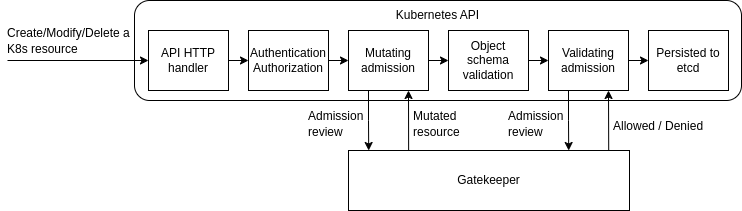

# Admission Control Service

This service validates the creation, modification and deletion of Kubernetes
resources within the Kubernetes cluster with the goal of meeting governance
and legal requirements, but also ensuring adherence to best practices and
institutional conventions.

## Overview

Kubernetes allows decoupling policy decisions from the inner workings of the
API server by means of admission controller webhooks, which are executed
whenever a resource is created, updated or deleted. This service provides
mutating and validating webhook that modify objects sent to the API server to
enforce custom defaults, or reject requests to enforce custom policies.

## Dependencies

The admission control service integrates by design with Kubernetes, the target
orchestration system of the GLACIATION platform. Indeed, by using
[Gatekeeper](https://github.com/open-policy-agent/gatekeeper), a customizable
cloud native policy controller that helps enforce policies executed by
[Open Policy Agent](https://github.com/open-policy-agent/opa), we can focus our
efforts in the configuration and definition of new policies.

## Architecture

Further details about the functioning of Gatekeeper can be found in the
[official documentation](https://open-policy-agent.github.io/gatekeeper/website/docs/operations).

## Terminology

| Term | Description |
|---|---|
| Admission controller | Component intercepting requests to the Kubernetes API server prior to persistence of the object |
| API server | Frontend to the cluster's shared state through which all Kubernetes components interact |
| Constraint | Enforce a ConstraintTemplate by specificying the kind of resources affected and the enforcement parameters |
| ConstraintTemplate | Definition of the Rego policy enforcing the policy and the schema of parameters to configure it |
| CustomResourceDefinition | Extension of the Kubernetes API not available in default Kubernetes installations |
| Mutating admission controller | Admission controllers that may modify objects related to the request they admit |
| Validating admission controller | Admission controllers that may not modify objects related to the request they admit |
