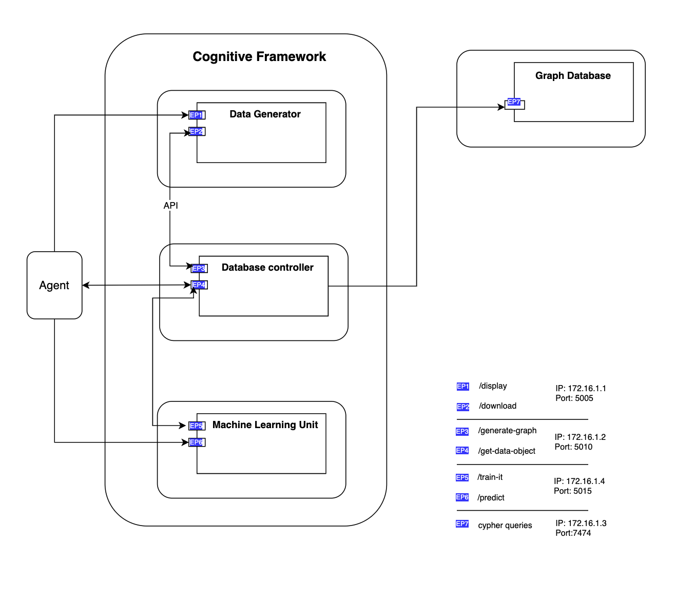
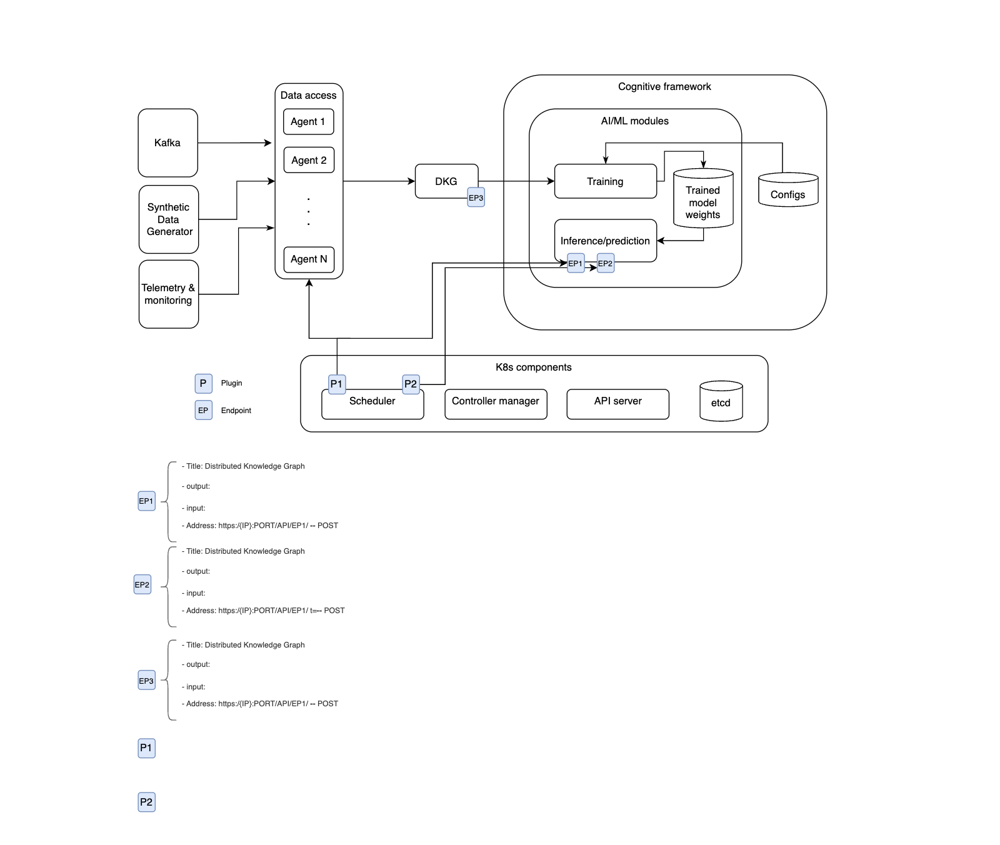
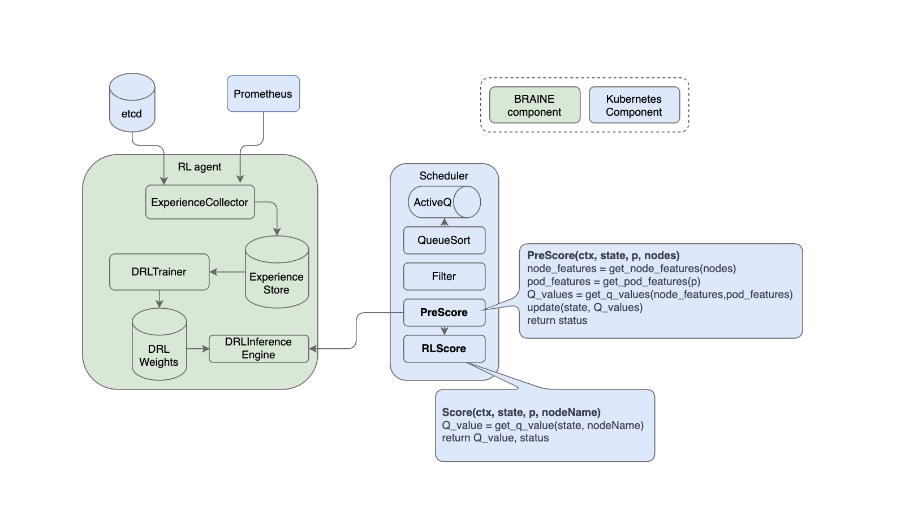

# Cognitive Framework

Doc stage: Draft  
Version: 1.0 

## Problem statement

We want to generate synthetic data, ingest that in a graph database and train a model based on that so it can predict best fit workernode for an incoming workload in a k83 cluster.

## Component Overview

**Description**:  
The framework in its current desing is consisted of 3+1 components. a) synthetic timeseries data generator b) database controller c) machine learning unit, and d) a Neo4j graph database.

**Objectives**:  
Both clients and the components connect via API to exchange data.  

- **Data generator** can be configured to generate an arbitrary number of workloads in different classes, and different power ratings for hardware components. The generated data is then provided via `/download` (.csv file) or `/display` to show the results in the browser. Additionally you may generate a new series of data using `/generate`.  
    Read more about the [Synthetic data generator](../src/modules/dc/README.md)

- **Database controller** ingest the generated timeseries data and pass it to the graph database. It also responds to the machine learning unit's requests and provides it with the queried data from the the database. DB contorller responds to the machine learning unit's requests via `/get_data_object`.  
    Read more about the [DB controller pipeline](../src/modules/db/README.md)
- **Machine learning** unit's is responsible for receiving workload submition requests and predicting a ranked list of candidate workernodes based on the demands of the workload and available resources on the cluster. ML unit responds to the aganet's requests via `/predict` and `/train`.  

    Read more about the [AI/ML module](../src/modules/ml/README.md)

## Service Dependencies:
A list of dependencies of each component can be found here:
1. [ML Unit](../src/modules/ml/requirements-docker.txt)
2. [DB Controller](../src/modules/db/requirements-docker.txt)
3. [Generator](../src/modules/dc/requirements.txt)

## Service Architecture/ API Diagram:

## Cognitive Framework - big picture

## rlkube

## RL-Score

## Further reading: 
- [Setup](setup-cognitive_framework.md) 