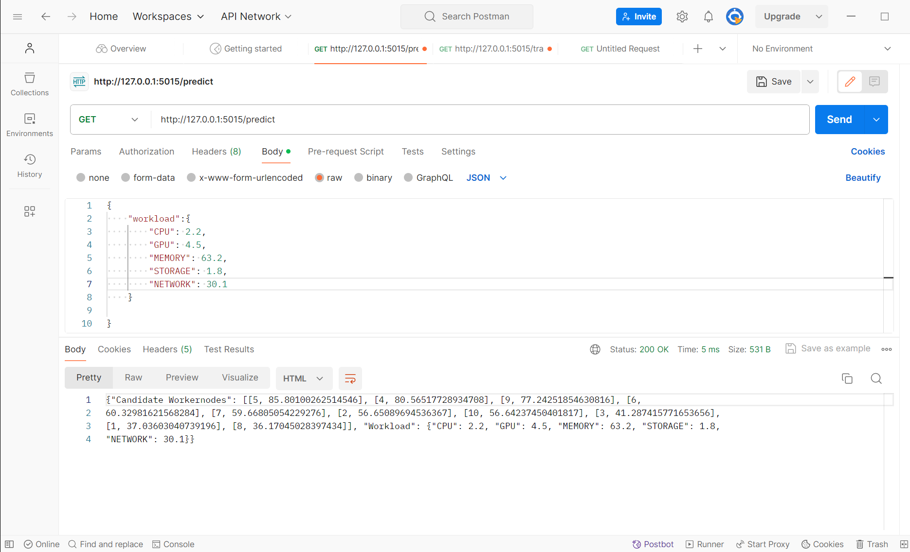

# Running the Pipeline as a Chain of Docker Containers
Follow these instructions to run the project:

## Deployment
### 1. Clone the repository
Clone the repository by executing the following commands:
```
git clone git@gitlab.com:idmg/glc/glc-repo.git
cd glc-repo/T32/src/modules/model/customized_gnn
```
### 2. Activate branch
Activate main branch using this cmmand:
```
git switch dev
```
### 3. Configuration:
Change the directory to the `T32\src\modules\db\db_docker\db` directory, and rename the `.env-example` to `.env` and add database configurations to the `.env`.

|Config|Description|Notes|
|:--|:------|:------|
|`neo4j_user`| The username of the neo4j connection| defined during the installation procss.|
|`neo4j_pswd`| The password of the neo4j connection| defined during the installation procss.|
|`neo4j_port`| The port number of connection| 7687 when `Bolt` is used as the application protocol.|


### 4. Create a Docker network
Create a docker network using this command:
```
docker network create --subnet=172.16.1.0/16 data-network 
```
### 5. Build and Run the Docker containers
Open four command terminals and execute each command in one terminal:  
First change directory to: `T32/src/modules`
- DC Docker:
```
docker build -t dc-1 dc/timeseries_generator/ 
docker run --name=dc --net=data-network --ip 172.16.1.1 -p 5005:8080 dc-1 
```
- Neo4j Docker:
```
docker pull neo4j
docker run --name=neo4j --net=data-network --ip 172.16.1.3 --publish=7474:7474 --publish=7687:7687  --volume=$HOME/neo4j/data:/data neo4j
```
Note: The command related to the Neo4j Docker should be run in PowerShell.
- DB Docker:
```
docker build -t db-1 db/db_docker/db/ 
docker run --name=db --network=data-network --ip 172.16.1.2 -p 5010:8080 db-1 
```
- ML Docker:
```
docker build -t ml-1 model/customized_gnn/ 
docker run --name=ml --network=data-network --ip 172.16.1.4 -p 5015:8080 ml-1
```
Points:

- Execute the Neo4j Docker command in PowerShell.
- Follow the steps sequentially, and start the next command after the previous one has finished executing.

## Usage
Requirements: Install Postman v10.23.10. Postman is a popular collaboration platform for API development. It provides various tools for designing, testing, and debugging APIs.

To utilize Postman effectively for sending an API request, follow the steps outlined below:
### To train the model:
1. Launch Postman:
Open Postman on your local machine.

2. Navigate to the 'Getting Started' Tab:
Click on the 'Getting Started' tab located in the top-left corner of the Postman interface.

3. Select 'Send an API Request':
Within the 'Getting Started' tab, locate and click on the option labeled 'Send an API Request'.

4. Configure the Request:
In the 'Untitled Request' window that appears, configure the request by following these steps:
    - Select the desired HTTP method type. For this demonstration, choose 'GET'.
    - Enter the endpoint URL http://127.0.0.1:5015/train_it into the address bar.

5. Send the Request:
After configuring the request, click on the 'Send' button located next to the address bar.

6. View the Response:
Once the request is sent, observe the output displayed at the bottom of the Postman interface. This section will present the response received from the server.

### To get predicted WorkerNodes for one Workload:
1. Open Postman:
Launch the Postman application on your local machine.

2. Access the 'Getting Started' Tab:
Navigate to the 'Getting Started' tab, situated at the top-left corner of the Postman interface.

3. Initiate API Request Submission:
Within the 'Getting Started' tab, locate the option labeled 'Send an API Request' and proceed to click on it.

4. Configure the Request Method:
Upon opening the 'Untitled Request' window, configure the request as per the following guidelines:

5. Select 'GET' as the HTTP method type.
Enter the desired endpoint URL http://127.0.0.1:5015/predict into the address bar.
Specify Request Body:
    - Switch to the 'Body' tab within the 'Untitled Request' window.
    - Select 'JSON' as the input format.
Enter the workload data as a dictionary (see the following example) or JSON object, as required by API.
```JSON
{
    "workload":{
        "GPU":1.2,
        "CPU": 2.8,
        "MEMORY":31.8,
        "STORAGE": 24.2,
        "NETWORK": 11.5
    }
}
```

6. Send the Request:
Once the request is appropriately configured, proceed to send it by clicking on the 'Send' button adjacent to the address bar.

By following these steps, you will be able to efficiently send an API request using Postman and analyze the corresponding output.

### Evaluate Response Display:
Upon submitting the request, analyze the output showcased at the bottom of the Postman interface. This segment illustrates the server's response to the request. Here, you can observe the process of inputting the workload in Postman and view the resulting output:

<div style="text-align: center;">
    
</div>
