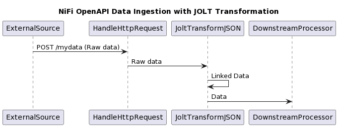

# Data Semantification Service

This services provides the primary entrypoint for data submission to the
GLACIATION platform.

## Overview

When raw data, e.g., csv or video, is submitted to the GLACIATION platform
it needs semantification. This means the transformation from raw data
to linked data. Linked data then can be either split into data/metadata
or stored within the DKG.

The goals of the service is to transform the input raw data to
Linked data or Linked metadata such that it can be stored in the DKG

## Dependencies

To use the service you must supply a NiFi Flow Controller (with Connections).
Furthermore, the JOLT (JsOn Language for Transform) must be embedded
in the Flow Controller.

## Architecture



Further details about [NIFI](https://nifi.apache.org/) and [JOLT](https://github.com/bazaarvoice/jolt)

## Domain Model/Terminology 

* **RawData:** Data submitted to the service for semantification. Supported formats include CSV, JSON, and video files (MPEG-4, AVI).

* **LinkedData:** The output of the semantification process, representing the RawData using a linked data format (RDF).

* **LinkedMetadata:** Metadata derived from the RawData, also represented in a linked data format.

* **TransformationSpec:** A JOLT specification that defines the rules for transforming RawData into LinkedData or extracting LinkedMetadata.  

The service utilizes concepts from the W3C's RDF standard for representing linked data.

## REST/OpenAPI Specification

**Endpoints**

* **`/submit` (POST):** Submits raw data for semantification.
    * **Parameters:**
        * `rawData` (file): The raw data file to be processed.
        * `format` (string): Specifies the format of the raw data (e.g., "csv", "json").
    * **Response:**
        * `jobId` (string):  A unique identifier for the submitted semantification job.

* **`/status/{jobId}` (GET):**  Retrieves the status of a semantification job.
    * **Parameter:**
        * `jobId` (string): The job identifier.
    * **Response:**
        * `status` (string): Status of the job (e.g., "pending", "in-progress", "completed", "failed").
        * `result` (string): If completed, a link to the resulting LinkedData or LinkedMetadata.
        * `error` (string): If failed, an error message.

**Example Request (submit)**

```bash
curl -X POST -F "rawData=@data.csv" -F "format=csv" http://your-service-url/submit

