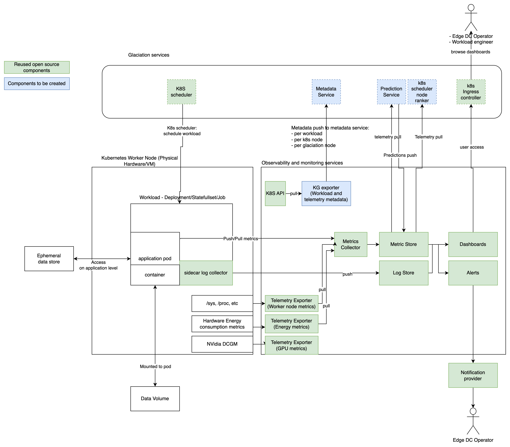

# Glaciation node and Workload Monitoring Services

Created by: Konstantin Tatarnikov
Created time: January 29, 2024 6:12 PM
Doc stage: Draft
Tags: Engineering
Version: 1.0

# Problem statement

We want to design workload monitoring services. The workload monitoring services,  observability services and performance measurement framework have a number of shared components, therefore we want to consider them together to drop redundancies.

# 1. Component Overview:

**Description**: 

Workload monitoring services are responsible for collecting and storing a telemetry for a period of time and making sure that that workload metadata and telemetry metadata are updated in the knowledge graph.

**Objectives**: 

Workload monitoring services collect resource metrics for the following scopes:

- user workload
- k8s worker node
- glaciation node

The metrics we want to gather should reflect the usage of resources:

- CPU usage
- Memory usage
- Disk Space usage
- Energy consumption

The monitoring services also need to gather logs information

- workload logs

The monitoring services materialize the knowledge graph of the workload and its telemetry when workload is started.

## 2. Service Dependencies:

### **Dependencies**

**Application workload** - user application workload. At the moment we define user workload as a containerized application - in k8s terms Deployment/StatefullSet/Job. The data volume can be attached to the container. The fluentd sidecar is automatically injected to workload to collect logs and the application needs to expose `/metrics` endpoint to allow metric collection.

**Kubernetes scheduler** - the scheduler that schedules application workload in the cluster/edge dc.

**Kubernetes scheduler node ranker** - node scoring plugin implementing node ranker model. It needs workload telemetry as input.

**Metadata Service** - is a knowledge graph API for glaciation node. The service keeps knowledge graphs in an internal repository and provides necessary interfaces tailored for various internal components.

**Prediction service** - Prediction service executes daily job that forecast telemetry usage and saves the forecast into storage service. Prediction service requests a telemetry knowledge graphs from metadata service 

**Notification provider** - notification provider that informs the edge DC operator about service downtime, faults or extensive resource consumption (e.g. PagerDuty, BetterStack etc).

### Components

**Side car log collector** - sidecar pod that collects the logs from the user workload. This is a [fluentd sidecar injector](https://github.com/h3poteto/fluentd-sidecar-injector/tree/master) that automatically injects sidecar based on user annotations, to Log Store. 

**Telemetry Exporter (node metrics)** - [prometheus node exporter](https://github.com/prometheus/node_exporter). The daemon set that exports worker node metrics.

**Telemetry Exporter (energy metrics)** - [kepler energy metrics exporter](https://sustainable-computing.io/). Exports energy metrics for node, namespace and workload scopes.

**Telemetry Exporter (GPU metrics)** - [nvidia dcgm exporter](https://github.com/NVIDIA/dcgm-exporter). Exports telemetry metrics for nvidia GPUs.

**KG Exporter (Workload and Telemetry exporter )** - The component listens to the k8s api for new workloads and updates corresponding knowledge graphs - workload and workload telemetry in metadata service. The exporter is not expected to have any AI features. It should render the knowledge graph based on the workload and workload telemetry knowledge graph template.

**Metrics Collector** - Metrics collector is a prometheus instance configured to scrape `/metrics` endpoint for all pods from all namespaces and to load metrics to metrics store.

**Metrics Store** - Metrics store is an instance of influx db.

**Alerts** - prometheus alerting manager integrated with notification provider

**Log Store** - Log storage is an instance of [Loki server](https://grafana.com/docs/loki/latest/). Together with fluentd side car and [fluentd client](https://grafana.com/docs/loki/latest/send-data/fluentd/) they enable log aggregation in log store.

**Dashboards** - Grafana instance with Log Store and Metrics Store datasources. There is a list of preconfigured dashboards with the major workload metrics.

## 3. Service Architecture:

**High-Level Architecture**: 

## **Data Flows**:

### Workload Scheduling flow

User can schedule work load in k8s cluster in a usual way by running `helm release ...` or by executing `kubectl apply ...` command. Note that the workload should be annotated with [fluentd injector annotations](https://github.com/h3poteto/fluentd-sidecar-injector/blob/master/README.md#usage) to be able to inject logger side car. The user workload is k8s native application the rest of the application lifecycle is handled by k8s ietself.

### Workload Telemetry Collection flow

We are collecting logs and metrics of the workload. The logs are collected by fluentd side car with fluentd-loki plugin that push the logs to Loki log store.

### Node Telemetry Collection flow

The node telemetry is collected by prometheus node exporter. The exporter exposes the node metrics in using `/metrics` endpoint.

### Glaciation Node Telemetry Collection flow

There is no telemetry collection for a glaciation node as central entity. The glaciation node is represented by a set of its services and worker nodes and each service and worker node can provide its own metrics. This means that each glaciation service must expose `/metrics` endpoint with corresponding metrics. 

The metrics aggregation is done on the level of prometheus queries by omitting the pod/application and node tags. Exact metrics are to be specified in the knowledge graph by the KG exporter.

### Exporting Workload and Telemetry knowledge graph flow

Component KG exporter is responsible for extracting workload, workload telemetry, glaciation node, glaciation telemetry knowledge graphs.

The component periodically polls/wait for events of k8s api for changes of workload resources - Deployments/StatefullSets/Jobs, produces the knowledge graph and updates the changes in the metadata service. It also updates the KG of the glaciation node when it is necessary (to be determined when).

Thus when the following events happen the knowledge graph is updated for a workload and workload telemetry:

- workload is started
- workload is stopped

We deliberately don’t want to add more fine grained events to avoid massive knowledge graph updates.

When KG starts it also ensures that the knowledge graph exists for a glaciation node itself and its telemetry.

We expect that Metadata Service has knowledge graph CRUD API:

**CRUD on subgraph:**

- POST/GET/PUT/ DELETE /subgraph/{id}
    - the format to be defined, e.g. [json-ld](https://json-ld.org/), [binary RDF](https://jena.apache.org/documentation/io/rdf-binary.html), [RDF HDT](https://www.w3.org/submissions/2011/SUBM-HDT-20110330/#key-hdtprocessor)

### Monitoring/Dashboard flow

The dashboards are kept in grafana instance. We provide a set of predefined dashboards where the common low-level metrics and logs can be viewed. The grafana is exposed to the users via k8s ingress controller.

### Telemetry Prediction flow

The prediction service generates daily predictions for a user workload and a glaciation node telemetry. The service polls metadata service and fetch workload telemetry knowledge graphs and then traverse knowledge graph and locates the dataset and its datasource details. Datasource should point to a prometheus endpoint and a subset of metrics in prometheus. Those metrics are then selected and used as a historical training data for predictions. Prometheus exposes query api and prediction service calls prom query API.

### Metadata

We want to define what properties/relations metadata knowledge graphs are expected to have. This is given below.

**Workload**

- application name
- if workload has data dependencies then links to Data KG
- link to telemetry KG:

**Workload Telemetry**

- link to metrics Data
- link to logs Data

**Data (Metrics)**

- type of data: timeseries, prometheus
- data source:
    - type: prometheus
    - http://prometeus.internal:9000
- list of metrics:
    - cpu_usage
        - unit: %
    - mem_usage
        - unit: mb
    - disk_usage
    - network_usage
    - energy_joules
    - … etc
- dashboard:
    - type: grafana
    - url: `https://glaciation-node1.gnetwork.com/dashboard/<grafana dashboard path>`

**Data (Logs)**

- type of data: logs, loki
- data source:
    - type: loki
    - http://loki.internal:9000
- dashboard:
    - type: grafana
    - url: `https://glaciation-node1.gnetwork.com/dashboard/<grafana dashboard path>`

**Node Metadata**

- type: k8s worker node
- link to telemetry KG

**Glaciation Node Metadata**

- type: GNode
- id: glaciation-node1
- url: `https://glaciation-node1.gnetwork.com/`
- link to telemetry KG