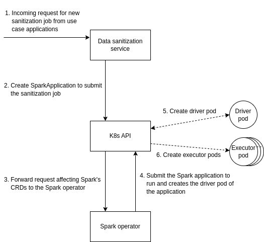
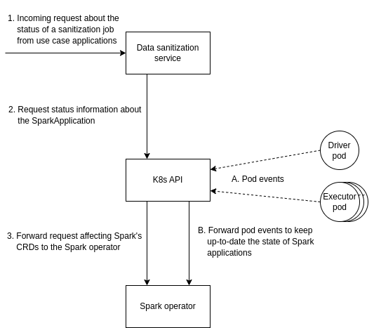

# Data Sanitization Service

This service implements an efficient and effective approach to protect user
privacy by obfuscating their identities or sensitive information.

## Overview

To scale the computation of the sanitized dataset to datasets of significant
sizes, our service operates on the input dataset in a distributed manner.

Three kind of transformations are supported: k-anonymity, l-diversity, and the
use of both of them. Sanitization jobs are configured by the requesting
application with numerous parameters with the goal of tailoring the
sanitization process according to the specific requirements of the application.
These parameters include the input and the output; the classification of
attributes in identifiers, quasi-identifiers and sensitive attributes;
k-anonymity and l-diversity privacy parameters; the function used for
determining the dataset cuts; the set of custom generalization methods for
quasi-identifiers (if any); and the list of information loss metrics to
compute.

The anonymization and obfuscation process leverages the availability of a
distributed architecture of workers. The service enables the configuration of
data distribution and processing, through several parameters. In particular,
parameters include the specification of the fraction of the original dataset to
be considered in this initial stage, the number of partitions, the
fragmentation strategy, and its parallelization and repartitioning scheme.

### Assumptions

The input dataset target of the sanitization process MUST be in tabular
format. However, thanks to the use of Apache Spark, the sanitization service
can support multiple data formats (e.g., Avro, CSV, Delta, Iceberg, Parquet,
and ORC). The selection of the specific parsing and serialization format
depends on the extension of the dataset.

The support of quasi-identifier and sensitive attributes with complex object
types is not supported out of the box. For these use cases consider flattening
the object in multiple distinct attributes when feasible, and introduce ad hoc
changes to the sanitization service otherwise.

## Dependencies

The sanitization service is an Apache Spark application. To seamlessly
integrate it within Kubernetes, the target orchestration system of the
GLACIATION platform, we need the following dependencies:

- First/Third party object store: An object store for persisting the input and
  the output datasets either within the Kubernetes cluster deployed with a
  native Kubernetes operator (e.g., [MinIO](https://github.com/minio/operator),
  [Rook](https://github.com/rook/rook)) or outside the cluster by referencing
  an external object store
- [spark-on-k8s-operator](https://github.com/GoogleCloudPlatform/spark-on-k8s-operator):
  Kubernetes operator for managing the lifecycle of Apache Spark applications
  on Kubernetes

## Architecture

Details about the functioning of the Spark operator can be found in the
[official design documentation](https://github.com/GoogleCloudPlatform/spark-on-k8s-operator/blob/master/docs/design.md).

### Submitting new data sanitization requests

### Monitoring the state of existing data sanitization requests

## Terminology

| Term | Description |
|---|---|
| column scoring | Assign a score to each quasi-identifying attribute to choose the current best target of the Mondrian cut |
| data sanitization | Irreversible transformation of data to provide privacy guarantees |
| generalization | Transformation of the attribute values to achieve k-anonymity and/or l-diversity |
| identifying attribute | Attribute that identifies the individual data subject |
| information loss | Estimation of the utility loss of the sanitized data for statistical analyses by end users (lower is better) |
| k-anonymity | Dataset property where every set of rows with identical quasi-identifiers has at least *k* rows |
| l-diversity | Dataset property where, for every set of rows with identical quasi-identifiers, there are at least *l* distinct values for each sensitive attribute |
| mondrian | Efficient and effective greedy algorithm for achieving k-anonymity and/or l-diversity |
| partition | A split of the data to distribute the work across the cluster |
| quantiles | Values splitting sorted data distributions into equal parts |
| quasi-identifying attribute | Attribute that together with other attributes can identify the individual data subject |
| repartitioning | Redistribution of the data across a specified number of partitions |
| sampling | Selection of a portion of the dataset to limit CPU and memory consumption while progressing with the sanitization job |
| sensitive attribute | Attribute that should not be linkable to an individual subject |
| shuffling | Exchange of data between nodes to be able to perform a task |

## [OpenAPI specification](docs/openapi.yaml)

## Publications

Additional information about the functioning of the service and its performance
against different datasets can be found in the following publications:

- [1] Sabrina De Capitani di Vimercati, Dario Facchinetti, Sara Foresti,
  Gianluca Oldani, Stefano Paraboschi, Matthew Rossi, Pierangela Samarati,
  **Scalable Distributed Anonymization Processing of Sensors Data**,
  in *Proceedings of the 19th IEEE International Conference on Pervasive
  Computing and Communications (PerCom)*, March 22-26, 2021
- [2] Sabrina De Capitani di Vimercati, Dario Facchinetti, Sara Foresti,
  Gianluca Oldani, Stefano Paraboschi, Matthew Rossi, Pierangela Samarati,
  **Artifact: Scalable Distributed Anonymization Processing of Sensors Data**,
  in *Proceedings of the 19th IEEE International Conference on Pervasive
  Computing and Communications (PerCom)*, March 22-26, 2021
- [3] Sabrina De Capitani di Vimercati, Dario Facchinetti, Sara Foresti,
  Giovanni Livraga, Gianluca Oldani, Stefano Paraboschi, Matthew Rossi,
  Pierangela Samarati, **Scalable Distributed Data Anonymization for Large
  Datasets**, in *IEEE Transactions on Big Data (TBD)*, June 01, 2023
