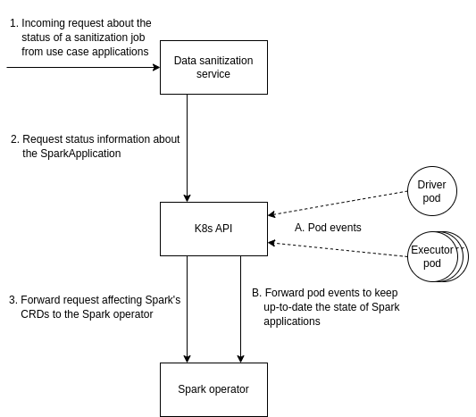

# Architecture

To scale the computation of the sanitized dataset to datasets of significant
sizes, our service operates on the input dataset in a distributed manner by
using Apache Spark – a multi-language engine for large-scale data analytics.
With the goal of making specifying and running sanitization applications
as easy and idiomatic as running other workloads on Kubernetes, the service
relies on the Kubernetes Operator for Apache Spark. Details about the
functioning of the Spark operator can be found in the
[official design documentation](https://github.com/GoogleCloudPlatform/spark-on-k8s-operator/blob/master/docs/design.md).

### Submitting new data sanitization requests

### Monitoring the state of existing data sanitization requests

## Dependencies

The sanitization service is an Apache Spark application. To seamlessly
integrate it within Kubernetes, the target orchestration system of the
GLACIATION platform, we need the following dependencies:

- First/Third party object store: An object store for persisting the input and
  the output datasets either within the Kubernetes cluster deployed with a
  native Kubernetes operator (e.g., [MinIO](https://github.com/minio/operator),
  [Rook](https://github.com/rook/rook)) or outside the cluster by referencing
  an external object store
- [spark-on-k8s-operator](https://github.com/GoogleCloudPlatform/spark-on-k8s-operator):
  Kubernetes operator for managing the lifecycle of Apache Spark applications
  on Kubernetes
