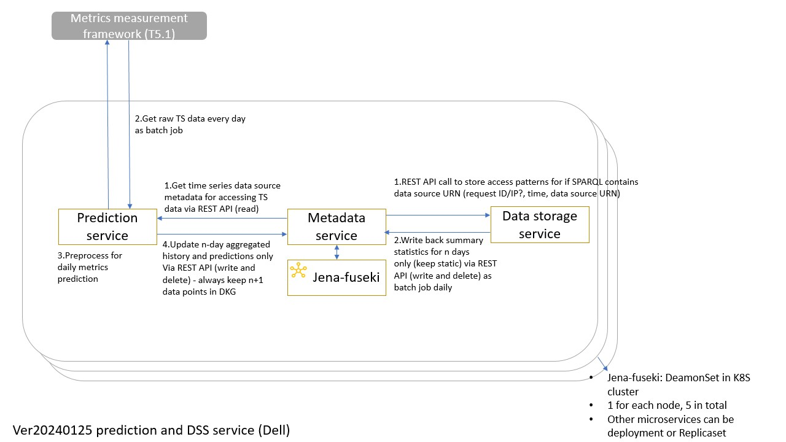

# Service Overview:
- Description: Store access patterns about data sources.
- Objectives: Keep track of how many times a data source has been queried in SPARQL requests.

# Service Dependencies:
- External Dependencies: N/A
- Internal Dependencies: Metadata microservice to write back a summary statistics for n days.

# Service Architecture:
 

# Contact
DELL Technologies (Guangyuan.Piao@dell.com)
