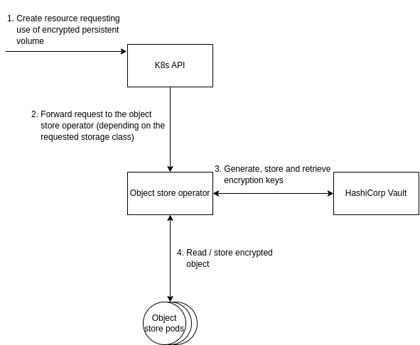

# Data Wrapping Service

This service offers server-side object encryption of Kubernetes volumes,
allowing clients to take advantage of server processing power to secure objects
at the storage layer (i.e., encryption at rest).

## Overview

Encrypting Kubernetes volumes offers a robust shield for sensitive data at
rest. This not only safeguards information from unauthorized individuals who
gain physical access to storage disks or underlying nodes, but also helps meet
industry standards and regulations. By limiting the blast radius of security
incidents, it strengthens operational security and builds trust with
stakeholders.

## Dependencies

To seamlessly integrate the wrapping service within Kubernetes, the target
orchestration system of the GLACIATION platform, we need the following
dependencies:

- First-party object store: An object store supporting transparent encryption
  of persistent volumes within the Kubernetes cluster deployed with a native
  Kubernetes operator (e.g., [MinIO](https://github.com/minio/operator),
  [Rook](https://github.com/rook/rook))
- [HashiCorp Vault](https://github.com/hashicorp/vault): A tool for secrets
  management, encryption as a service, and privileged access management

## Architecture

Further details about the functioning of object store operators and their
integration with HashiCorp Vault can be found in the official documentation
of [MinIO](https://min.io/docs/minio/kubernetes/upstream/administration/server-side-encryption.html)
and [Rook](https://rook.io/docs/rook/latest-release/Storage-Configuration/Advanced/key-management-system/#vault).
