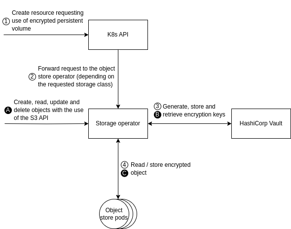

# Data Wrapping Service

This service offers server-side object encryption of Kubernetes volumes,
allowing clients to take advantage of server processing power to secure objects
at the storage layer (i.e., encryption at rest).

## Overview

Encrypting Kubernetes volumes offers a robust shield for sensitive data at
rest. This not only safeguards information from unauthorized individuals who
gain physical access to storage disks or underlying nodes, but also helps meet
industry standards and regulations. By limiting the blast radius of security
incidents, it strengthens operational security and builds trust with
stakeholders.

## Dependencies

To seamlessly integrate the wrapping service within Kubernetes, the target
orchestration system of the GLACIATION platform, we need the following
dependencies:

- First-party object store: An object store supporting transparent encryption
  of persistent volumes within the Kubernetes cluster deployed with a native
  Kubernetes operator (e.g., [MinIO](https://github.com/minio/operator),
  [Rook](https://github.com/rook/rook))
- [HashiCorp Vault](https://github.com/hashicorp/vault): A tool for secrets
  management, encryption as a service, and privileged access management

## Architecture



Further details about the functioning of object store operators and their
integration with HashiCorp Vault can be found in the official documentation
of [MinIO](https://min.io/docs/minio/kubernetes/upstream/administration/server-side-encryption.html)
and [Rook](https://rook.io/docs/rook/latest-release/Storage-Configuration/Advanced/key-management-system/#vault).

## Terminology

| Term | Description |
|---|---|
| Binding | One-to-one mapping between the PersistentVolumeClaim and its PersistentVolume |
| PersistentVolume (PV) | Storage resource provisioned by an administrator or dynamically provisioned using Storage Classes |
| PersistentVolumeClaim (PVC) | Request for storage by a Pod |
| Provisioning | Process of assigning new storage resources to the cluster |
| Reclaim policy | What to do with the volume after it has been released of its claim (e.g., retain, delete) |
| ReadOnlyMany | Volume can be mounted as read-only by many nodes |
| ReadWriteMany | Volume can be mounted as read-write by many nodes |
| ReadWriteOnce | Volume can be mounted as read-write by a single node |
| ReadWriteOncePod | Volume can be mounted as read-write by a single Pod |
| Storage Class | Describe the class of storage (e.g., encrypted) |

## Kubernetes resources

The following showcases basic usage of persistent volume claims by pods. For a
complete view of the details regarding persistent volumes please refer to the
official [documentation](https://kubernetes.io/docs/concepts/storage/persistent-volumes/).

### PersistentVolumeClaim

```yaml
apiVersion: v1
kind: PersistentVolumeClaim
metadata:
  name: my-encrypted-volume-claim
spec:
  accessModes:
    - ReadWriteOnce
  resources:
    requests:
      storage: 4Gi
  storageClassName: encrypted
```

### Pod with a PersistentVolumeClaim

Pods access storage by using the claim as a volume. The cluster finds the claim
in the Pod's namespace and uses it to get the PersistentVolume backing the
claim. The volume is then mounted to the host and into the Pod.

```yaml
apiVersion: v1
kind: Pod
metadata:
  name: my-database
spec:
  containers:
    - name: postgres
      image: postgres
      volumeMounts:
      - mountPath: /var/lib/postgresql/data
        name: my-encrypted-volume
  volumes:
    - name: my-encrypted-volume
      persistentVolumeClaim:
        claimName: my-encrypted-volume-claim
```
