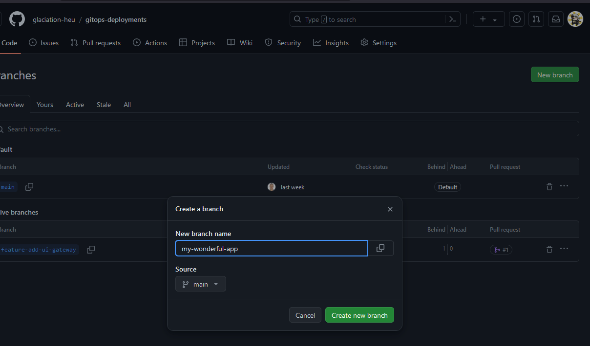

# deploy-guide

Created by: Alina Kovtun
Created time: March 26, 2024 3:18 PM
Doc stage: Draft
Tags: Engineering, Guides
🎯 Projects: GLACIATION (https://www.notion.so/GLACIATION-98086b456bce4b4ca63fbd0bf787610c?pvs=21)

# Step 1

To deploy your application on our cluster you need to have k8s/kustomize manifests or Helm char first. Take a look at our [template repository](https://github.com/HIRO-MicroDataCenters-BV/template-python) and it's Github Actions workflow that automatically makes a Helm chart and stores it in a Github Helm repository. We suggest you use our template.

# Step 2

We use [ArgoCD](https://www.youtube.com/watch?v=MeU5_k9ssrs) to deploy applications to our cluster. To automate deployment even further we use [app of apps](https://argo-cd.readthedocs.io/en/stable/operator-manual/cluster-bootstrapping/#app-of-apps-pattern) pattern. From you we want only two things: `application` manifest and pull request to [Glaciation deployments repository](https://github.com/glaciation-heu/gitops-deployments).

Use one of examples below.

### Helm chart example

Replace:

- `name` in the `metadata` section - it's the name of your application
- `namespace` in the `spec` section - under which namespace your app will be deployed #TODO: Decide with partners and the team
- `repoURL` - URL of the helm chart repository
- `chart` - name of the chart
- `targetRevision` - which version to pull. Versioning and wildcard explained very well in the [docs](https://argo-cd.readthedocs.io/en/stable/user-guide/tracking_strategies/#helm) .

```yaml
apiVersion: argoproj.io/v1alpha1
kind: Application
metadata:
  name: your-application-name  #This is your application name
  namespace: argocd
  finalizers:
  - resources-finalizer.argocd.argoproj.io
spec:
  destination:
    namespace: *YET-TO-DECIDE* #TODO: Decide with partners and the team
    server: <https://kubernetes.default.svc>
  project: default
  source:
    repoURL: <https://hiro-microdatacenters-bv.github.io/template-python/helm-charts> #TODO: our example repo is fine?
    chart: your-chart-name #This is how your helm chart is named in your helm repo
    targetRevision: 0.*.* #Chart version to pull, * means wildcard and pull the latest patch or minor version in this case
  syncPolicy:
    automated:
     prune: true
     selfHeal: true
    syncOptions:
      - CreateNamespace=true
      - ServerSideApply=true

```

### Kustomize/k8s manifests example

Replace:

- `name` in the `metadata` section - it's the name of your application
- `namespace` in the `spec` section - under which namespace your app will be deployed #TODO: Decide with partners and the team
- `repoURL` - url of the Git repository where manifests stored
- `path` - path to the manifests
- `targetRevision` - which version to pull. Versioning and wildcard explained very well in the [docs](https://argo-cd.readthedocs.io/en/stable/user-guide/tracking_strategies/#helm) .

```yaml
apiVersion: argoproj.io/v1alpha1
kind: Application
metadata:
  name: your-application-name  #This is your application name
  namespace: argocd
  finalizers:
  - resources-finalizer.argocd.argoproj.io
spec:
  destination:
    namespace: *YET-TO-DECIDE* #TODO: Decide with partners and the team
    server: <https://kubernetes.default.svc>
  project: default
  source:
    repoURL: <https://github.com/argoproj/argocd-example-apps> #TODO: argocd example repo is fine?
    path: kustomize-guestbook #path to the manifests. Can be just name of the directory or consecutive directories e.g. example/example-app
    targetRevision: HEAD
  syncPolicy:
    automated:
     prune: true
     selfHeal: true
    syncOptions:
      - CreateNamespace=true
      - ServerSideApply=true

```

To get a better understanding you can read [ArgoDocs](https://argo-cd.readthedocs.io/en/stable/operator-manual/declarative-setup/#applications)

# Step 3

#TODO: naming of applications manifest files - how we name them? how do partners name them?

1. Create a new branch named `my-wonderful-application.` Set `main` as source branch
    1. 
    
    
    
2. Add your application manifest in `intergration/apps` folder
    1. `Add file` > `Create new file`
        
        
        
    2. Name the file as your application is named, paste one of the examples from above, and replace the required fields. Then press `Commit changes...`
        
        
        
3. Create a [pull request](https://docs.github.com/en/pull-requests/collaborating-with-pull-requests/proposing-changes-to-your-work-with-pull-requests/creating-a-pull-request-from-a-fork) with your changes to the Glaciation repository
    1. In a Glaciation https://github.com/glaciation-heu/gitops-deployments repo proceed to `Pull requests`
    
    
    
4. Review your changes, then press `Create pull request`
    
    
    
    1. Once the PR is merged, your application will become visible within the ArgoCD interface.