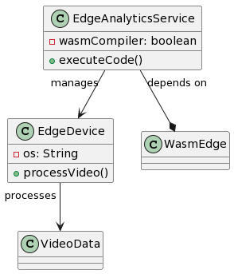

# Live analytics at edge computation

This services facilitates the execution of code (specifically code for analytics)
on edge device. For example, UC2 will deploy this on the 5200 gateways.

## Overview

Processing at the edge is one of the most important locations for processing
within the GLACIATION platform. For example, in a manufacturing setting, processing
will take place on edge devices. There is a significant chance this processing
will be on video which is not data that we want to either store at the edge
or move within the platform.

## Service Dependencies

This service leverages WasmEdge for processing at the edge. Therefore, it is
expected the service will either carry out wasm compilation or accept
wasm files for analytics.

## Domain Model/Terminology

* **EdgeDevice:** Represents a physical 5200 gateway or other edge computation device. Properties:
    * `deviceId` (string)
    * `location` (string)
    * `hardwareSpecs` (object)

* **AnalyticsCode:** Contains the logic to be executed on the edge device (in Wasm format). Properties:
    * `code` (WASM binary) 
    * `metadata` (object - version, author, etc.)

* **AnalyticsTask:** Represents a deployment instance of AnalyticsCode on an EdgeDevice. Properties:
    * `taskId` (string)
    * `edgeDeviceId` (string)
    * `analyticsCodeId` (string)
    * `status` (string - e.g., "deployed", "running", "completed")

## REST/OpenAPI Specification

**Endpoints**

* **`/deploy` (POST):** Deploys analytics code to an edge device.
    * **Parameters:**
        * `edgeDeviceId` (string)
        * `analyticsCode` (Wasm file) 
    * **Response:**
        * `taskId` (string)

* **`/tasks/{taskId}/status` (GET):** Retrieves the status of an analytics task.
    * **Parameter:**
        * `taskId` (string)
    * **Response:** 
        * `status` (string)
        * `result` (optional - link to result data if applicable)
