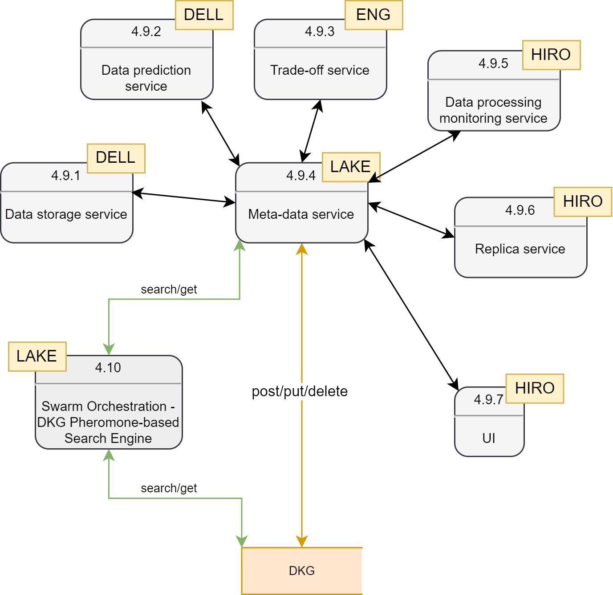
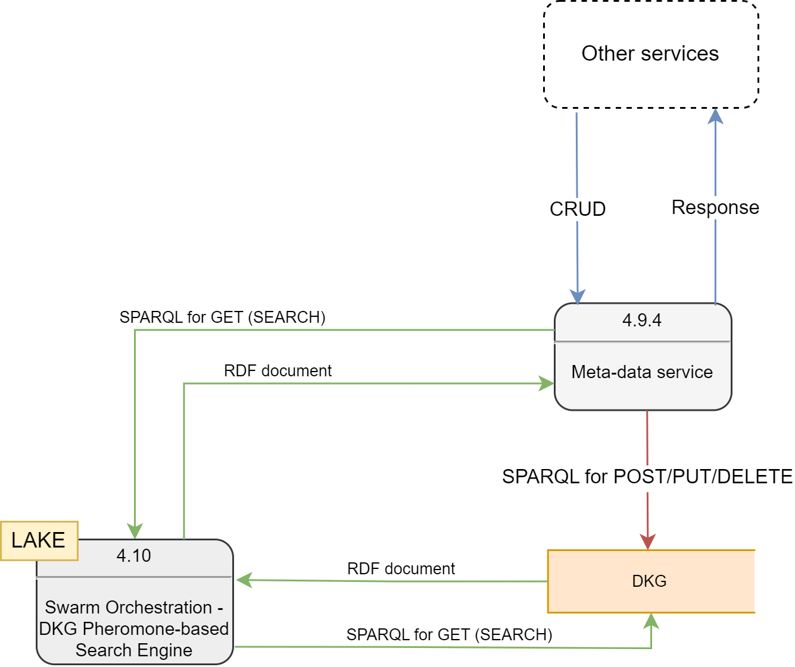

# DKG Replica Service Design (v1.1)

Created by: Oleksandr Chepizhko, Péter Forgács
Created time: February 07, 2024 4:00 PM
Doc stage: Draft
Tags: Engineering
Version: 1.0

# Problem statement

The problem we want to solve is to provide acces to the Distributed Knowledge Graph (DKG) through OpenAPI interface for the other microservices.

## 1. Component Overview:

**Description**

Metadata service is a microservice responsible for CRUD (Create, Read, Update, Delete) operations on the DKG.

**Objectives**: 

- Provide an interface for accessing the DKG for `post`/`put`/`delete` operations.
- Provide an interface to call search engine on DKG for the `get` operation.

## 2. Service Dependencies:

### **Dependencies**

- All the other microservices depend on the Metadata service in accessing the DKG.
- The Metadata service is connected to the Pheromone-based Search Engine, as the search is carried out by that component. The Search Engine can also provide insights into data usage.

## 3. Service Architecture

### **High-Level Architecture**

#### **Components**

- Component to alter a partition on a given node, i.e., post/put/delete (shown in orange).
- Component to search for a pattern matching a query by calling search engine (shown in green).

