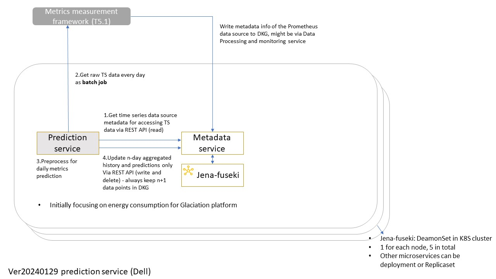

# Service Overview:
- Description: Provide forecasting functionality with high-granularity time series data.
- Objectives: Provide energy consumption prediction for the next day/month.

# Service Dependencies:
- External Dependencies: Performance measurement framework to get raw data based on metadata about this datasource from Metadata microservice. The metadata information of the performance metrics might be donw via Data Processing and Monitoring microservice.
- Internal Dependencies: Metadata microservice for read/write. 

# Service Architecture:
 

# Contact:
DELL Technologies (Guangyuan.Piao@dell.com)
