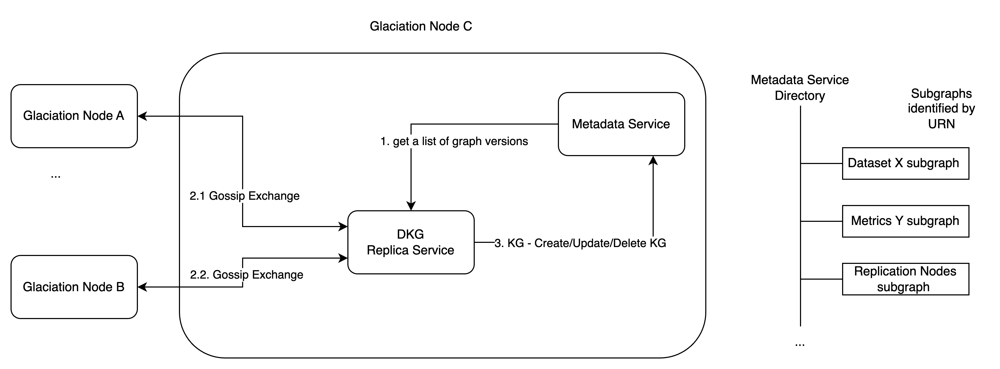

# DKG Replica Service Initial Design

Created by: Konstantin
Created time: January 23, 2024 3:26 PM
Doc stage: Approved
Tags: Engineering

# Problem statement

The simple problem we want to solve is to replicate parts knowledge graph. 

## Context

The proposal document indicates that we want to replicate not only the data but also the knowledge graph and therefore we want to define responsibilities and interactions between the following services:

- DKG Replica Service
- Metadata Service

The document below is initial sketch or that.

### **Terminology**

**Glaciation Node (GNode)**

- a Edge DC where glaciation services and user applications are running.
- Glaciation node is identified by URN, e.g. <glaciation node public key>
- Glaciation node can connect to each other in peer to peer manner
- GNode is a running on kubernetes cluster (1 to 1 mapping)
- GNodes are connected by network

**Knowledge Graph**

- a set of nodes and their relations, in practical terms set of RDF tuples

**Knowledge Subgraph**

- a self-contained, disjoint subgraph describing single concept, object or phenomena- e.g. DataSet subgraph, Metrics Subgraph, a list of replications subgraph
- identified by URN, e.g. <glaciation node public key>/<unique id of the data element>
- has a timestamp - indicating the timestamp when the subgraph has been created
- has a version - monotonically increasing counter

**Data** 

- a subgraph describing data, you can thing about RDF description of a data chunk
- we can define the following metadata for a data
    - data dynamic property: streaming, static
    - periodicity: interval at (<timestamp>), continuous
    - format: csv, parquet, txt, etc

**Replication**

- identified by URN
- refers to a subgraph
- indicates the source node where the data need to be replicated from

## Interaction between services

**DKG Replica Service:**

- periodically polls metadata service and fetch subgraph hashes
- check if subgraph has changed in the origin
- download and updates subgraph in metadata service

The responsibilities below are give from perspective of DKG replica service

**Metadata Service:**

The minimal requirements are: 

- keeps subgraphs in two forms
    - in the form of graph (apache jena/SparkQL) for UX/Dashboards
    - in the form of a directory of subgraphs - so it is easy to CRUD them from replication service perspective
- keeps the information about each subgraphs origin
- allow CRUD on subgraph
    - POST/GET/PUT/ DELETE /subgraph/{id}
- Api for getting subgraph versions
    - GET /subgraphs_versions
        - response contains map of “subgraph_id”: “subgraph_version”
    - assuming the changes are not frequent
- TBD Full graph api (SPARKQL) for UX/Dashboards
    - sparkql is generated by UI
    - or UX API Gateway component
- Metadata Service should keep track of data usage metrics
    - GET /subgraph/{id}/metrics
    
    ```bash
    {
    	<map of metrics>
    }
    ```
    
- We should consider keeping metrics in Jena’s database

Note that replica service does not decide from where and which subgraphs need to be replicated, this is done by the other services.



Follow up and decisions

- This is taken as working version of replication of distribute knowledge graph