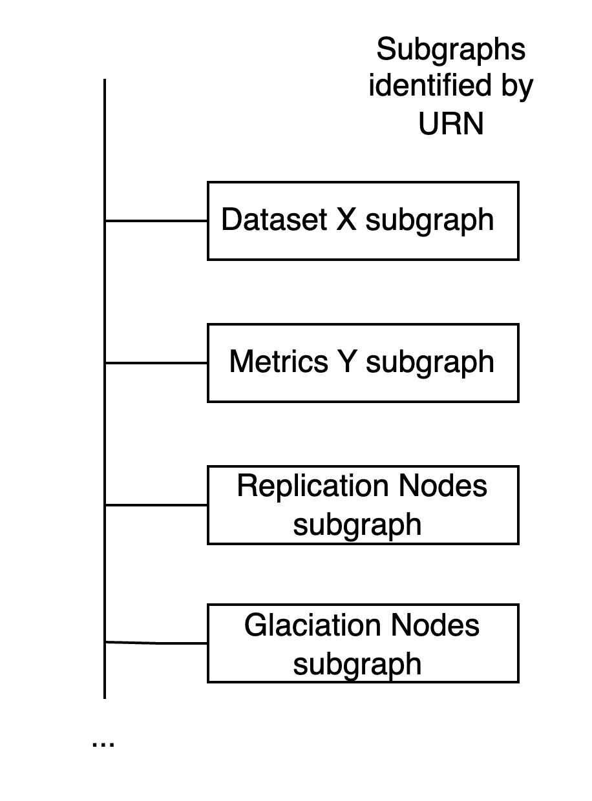
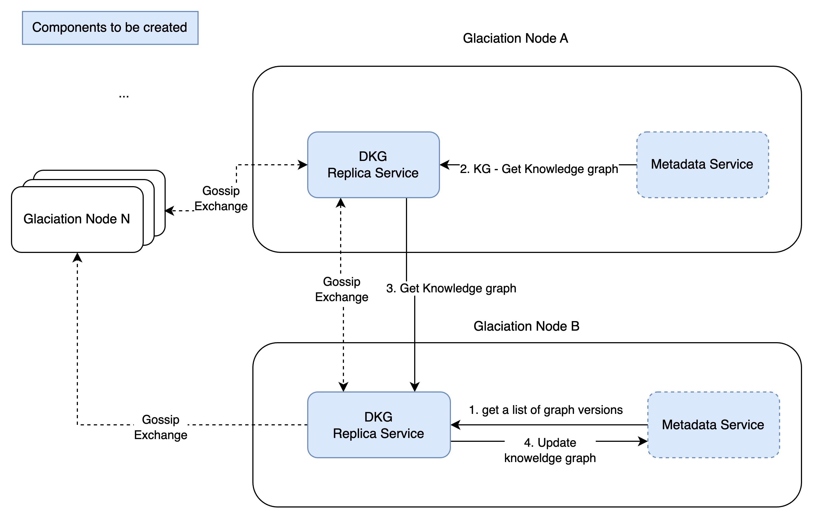

# DKG Replica Service Design (v1.1)

Created by: Konstantin Tatarnikov
Created time: January 30, 2024 6:00 PM
Doc stage: Draft
Tags: Engineering
Version: 1.1

# Problem statement

The problem we want to solve is to replicate parts of distributed knowledge graph. 

### **Terminology**

**Glaciation Node (GNode)**

- a Edge DC where glaciation services and user applications are running.
- GNode also can be seen as a k8s cluster installed in edge DC
- Glaciation node is identified by node URN, e.g. “<node domain name>”
- Glaciation node can connect to each other in peer to peer manner
- GNode is a running on kubernetes cluster (1 to 1 mapping)
- GNodes are connected by network

**Knowledge Graph**

- a set of nodes and their relations, in practical terms set of RDF tuples

**Knowledge Subgraph**

- a self-contained, disjoint subgraph describing single concept, object or phenomena- e.g. DataSet subgraph, Metrics Subgraph, a list of replications subgraph
- identified by URN, e.g. <node domain name>/<unique id of the data element>
- has a timestamp - indicating the timestamp when the subgraph has been created
- has a version - monotonically increasing counter

**Data** 

- a subgraph describing data, you can thing about RDF description of a data chunk
- we can define the following metadata for a data
    - data dynamic property: streaming, static
    - periodicity: interval at (<timestamp>), continuous
    - format: csv, parquet, txt, metrics, etc

**Replication**

- identified by URN
- refers to a subgraph
- indicates the source node where the data need to be replicated from

## 1. Component Overview:

**Description**

DKG Replica service is a service responsible for replication of knowledge subgraphs between glaciation nodes.

**Objectives**: 

For simplicity we would like to split the design and implementation of the service into two increments: DKG replica service integration and optimised replication of knowledge subgraphs using swarm mechanism.

DKG replica service integration will produce suboptimal replication schema, but solves integration task. For this increment we assume all knowledge graphs are replicated to all glaciation nodes.

Optimised replication of knowledge subgraphs is a further refinement where we want to replicate only necessary parts of DKG.

Below we provide responsibilities of DKG Replica service as we see it for the DKG replica service integration increment. DKG replica service should 

- Determine the changes in the knowledge subgraphs and communicate to other GNodes with the information about new version of a knowledge subgraph
- Detect if a knowledge subgraph has been updated and pull new version from the origin GNode
- Handle GET requests from other GNodes and return updated knowledge subgraphs

## 2. Service Dependencies:

### **Dependencies**

**Metadata Service**

The minimal requirements are: 

- Metadata service keeps subgraphs in two forms
    - in the form of big graph accessible by SparkQL for such uses cases like UX/Dashboards
    - in the form of a directory of subgraphs identified by subgraph id - to simplify CRUD operation from replication service perspective
- Metadata service will keep the information about each subgraphs origin
- allow CRUD on subgraph
    - POST/GET/PUT/ DELETE /subgraph/{id}
- Api for getting subgraph versions
    - GET /subgraphs_versions
        - response contains map of “subgraph_id”: “subgraph_version”
    - assuming the changes are not frequent
- TBD Full graph api (SPARKQL) for UX/Dashboards
    - sparkql is generated by UI
    - or UX API Gateway component
- Metadata Service should keep track of data usage metrics
    - GET /subgraph/{id}/metrics
    
    ```bash
    {
    	<map of metrics>
    }
    ```
    
- We should consider keeping metrics in Jena’s database



Note that replica service does not decide from where and which subgraphs need to be replicated, this is done by the other services.

### **Components**

**DKG Replica Service:**

Periodically polls metadata service and fetch subgraph versions and exchange the changes with other glaciation nodes using gossip exchange protocol.

If the version of the subgraph has changed in the origin, the other nodes download and updates subgraph in metadata service.

## 3. Service Architecture

**High-Level Architecture**



### **Data Flows**

**Gossip exchange flow**

DKG replica service periodically picks a number of other GNodes and disseminate last N updated knowledge subgraph ids and their versions.

**Download updated graph flow** 

If DKG replica service detects new version of knowledge subgraph, then it can download/pull new version and ingest into Metadata Service.