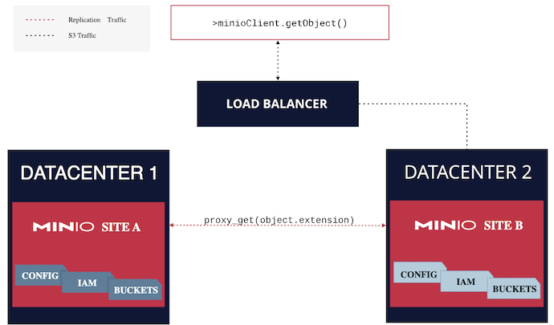

# Problem statement

We want to replicate data between k8s clusters in decentralised, data agnostic way using k8s technology as much as possible. The solution we want to chose may rely on storage technology features or can be storage agnostic.

# Components

- MinIO object storage - The purpose of this component is to ensure that a workload data is replicated to sustain the failure of a kubernetes worker node where the replica of the data resides. In case if this happens kubernetes scheduler will forward the calls to the other replica. 

For AI/ML and Analytics workloads that process large data sets an object storage fits the best. The requirement for the storage is to have a possibility of replicating the data in the same kubernetes cluster as well as across kubernetes clusters in a simple way without much overhead. 

# Technology

The technology proposed is MinIO object storage. The minIO is a popular storage system for AI/ML, distributed query, analytics, data lake components. The minIO is simple to use and can be installed in a kubernetes cluster running on hardware with commodity JBOD disks (Just a Bunch Of Disks). The disk volumes can be encrypted with external key management system. 

The replication can be done on the level of the cluster or site.

The replication on the level of the cluster is implemented with erasure coding. Minimal number of server nodes for distributed deployment is 4 and MinIO can tolerate the loss of up to half the drives or nodes in the deployment while maintaining read access (“read quorum”) to objects. More details about erasure coding implementation can be found here20. 

The multisite replication is a form of replication between 3 or more MinIO deployments. This can be configured on the level of the bucket using rules. More details about server-side bucket replication is available [here](https://min.io/docs/minio/linux/operations/concepts/erasure-coding.html#minio-erasure-coding).  

## Interaction between services

The workload can read and write data using s3-compatible protocol. There are many libraries that can be used for accessing minIO buckets by [applications](https://min.io/docs/minio/linux/administration/bucket-replication.html#minio-bucket-replication-serverside). 

 