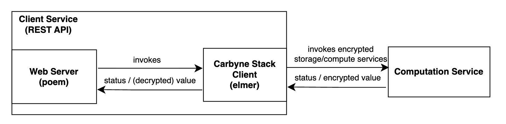
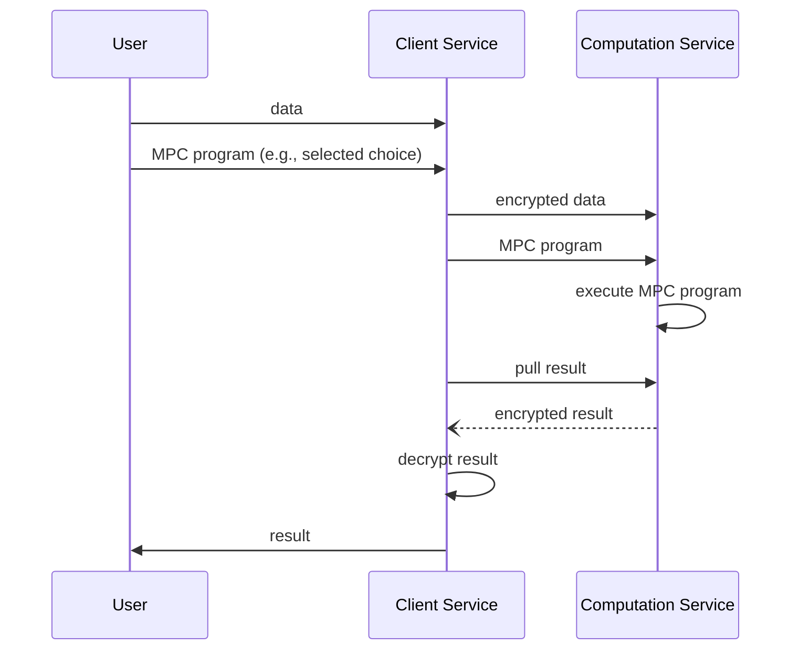

# Client Service

## 1-Component Overview:
**Description:**
The Client Service provides a simple interface for the Secure Collaborative Computation (Computation Service).

**Objective:**
The Client Service decouples data ingestion and encryption from the actual computation on encrypted data.
The Client Service has access to the sensitive data and runs in one trust domain (e.g., on-premise, edge) whereas the Computation Service only sees encrypted data and can run in another trust domain (e.g., cloud).
Specifically, the Client Service handles secret-sharing based encryption and decryption for upload and download of inputs and results, respectively. (In the language of MPC, the Client Service can be seen as the input party and the Computation Service as an abstraction of the computation parties.)

## 2-Service Dependencies:
**External Dependencies:**
The Client Service uses Carbyne Stack client library [elmer](https://github.com/carbynestack/elmer) for the cryptographic tasks. It is designed as a REST-API using the [poem](https://github.com/poem-web/poem/tree/master) web framework.

**Internal Dependencies**:
We require a Computation Service (which executes the MPC program) to interface with the Client Service (which mainly provides the program inputs).

## 3-Service Architecture:
**High-Level Architecture**:
The architecture ([draw.io file](diagrams/client-service.drawio)) is shown below and detailed next:

**Data Flow**:
The User invokes the Client Service which interfaces with the Computation Service.
(For lower-level interaction between Client Service and Computation Service, see Secure Collaborative Computation.)

## 4-REST API
The Rest-API is described by the provided [OpenAPI](openapi.yml) specification.