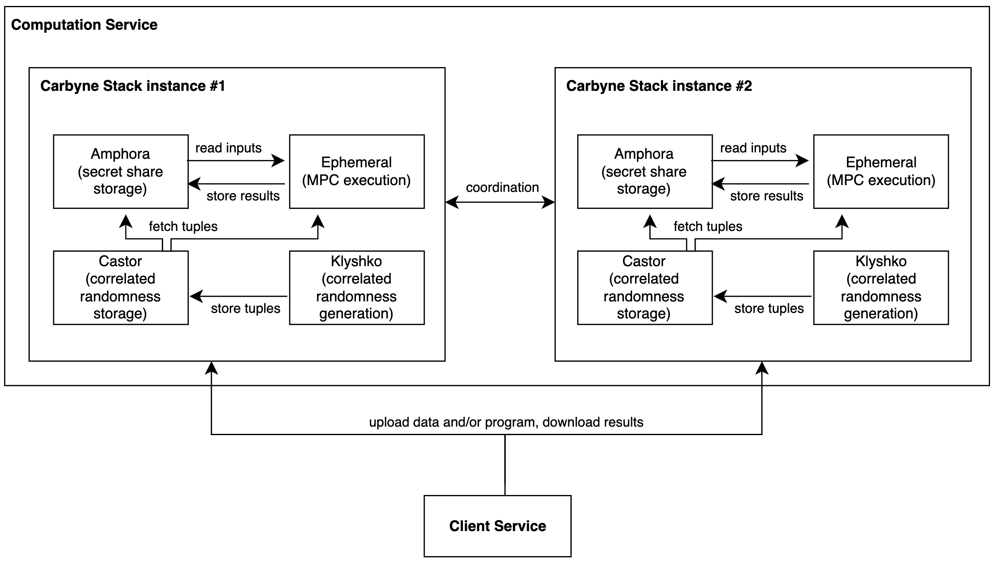
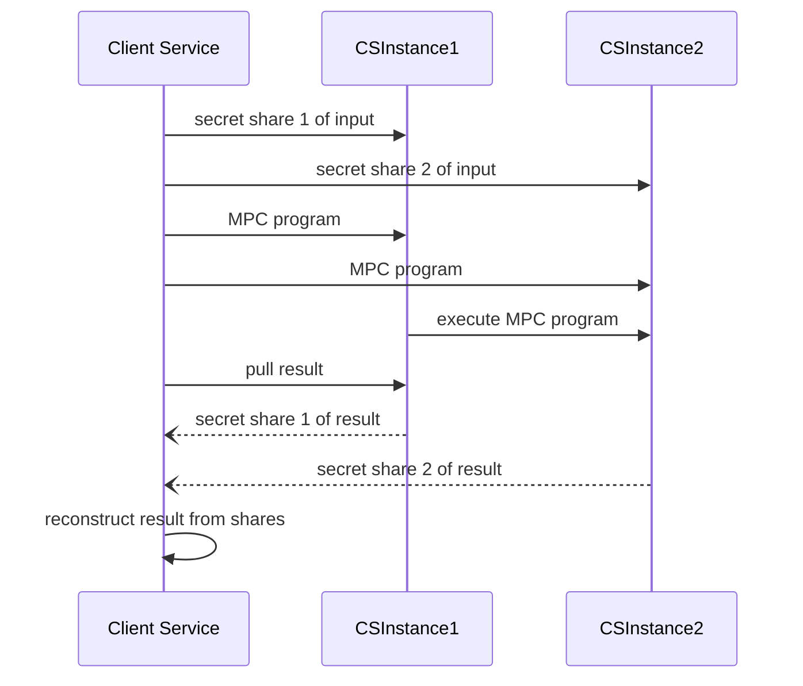
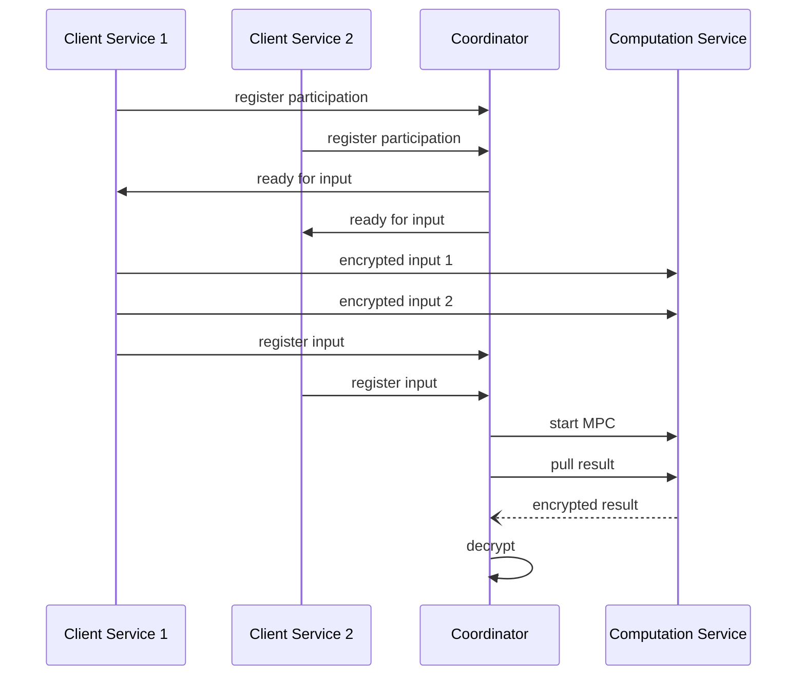

# Computation Service

## 1-Component Overview:
**Description:**
The component's purpose is protecting sensitive data from multiple input parties during a collaborative computation with secure multi-party computation (MPC). In MPC, multiple computing parties run a distributed computation on encrypted data from one or more input parties. MPC allows evaluating functions on data that only reveals the function output but never the data itself. For technical description of MPC, see the [introductory paper by Lindell](https://eprint.iacr.org/2020/300.pdf).

**Objective:**
The objective is to foster secure data collaborations. Specifically, revealing insights derived from sensitive data from multiple parties without exposing the underlying data to anyone. Furthermore, it permits outsourcing of computation in a cloud environment without having to decrypt the data in use.

## 2-Service Dependencies:
**External Dependencies:**
The component is realized with the cloud-native MPC stack [Carbyne Stack](https://github.com/carbynestack/carbynestack) from Bosch Research where SAP is a [contributor](https://carbynestack.io/community/ecosystem/#sap).
Carbyne Stack provides a software bill of material [(SBOM)](https://github.com/carbynestack/carbynestack/blob/master/3RD-PARTY-LICENSES/sbom.json) with further dependencies.

**Internal Dependencies**:
We require a Client Service to interface with the Computation Service to store/retrieve (encrypted) inputs/results.
While the Computation Service models the computation parties in MPC, the Client Service models the input parties in MPC.

To simplify coordination in a collaborative scenario, we envision a possible additional Coordinator component.

## 3-Service Architecture:
**High-Level Architecture**:
The architecture ([draw.io file](diagrams/carbynestack.drawio)), adapted from the [Carbyne Stack website](https://carbynestack.io/getting-started/overview/), is shown below and detailed next:

We currently consider two main services:
- Computation Service (this component): consists of the computing parties in MPC. We consider 2 computing parties realized as Carbyne Stack instances which handle the computation on encrypted data.
- Client Service (another component): provides input parties with an interface to the Computation Service. It handles secret-sharing based encryption and decryption for upload and download of inputs and results, respectively.

Here, our focus is on the computation parties, i.e., Computation Service. It is realized with Carbyne Stack which contains 4 microservices:
- Klyshko: runs pre-computation of (data-independent) correlated randomness aka tuples that speed up the (data-dependent) MPC program execution (for high-level explanation, see, e.g., [this](https://medium.com/applied-mpc/a-crash-course-on-mpc-part-2-fe6f847640ae))
- Castor: stores the Klyshko-created tuples.
- Amphora: store the secret shares.
- Ephemeral: executes the MPC program, consuming tuples from Castor and using secret shares from Amphora.

For further details about Carbyne Stack's service components we refer to the [Carbyne Stack Getting Started Guide](https://carbynestack.io/getting-started/overview/).

**Data Flow**:
The input client provides i) encrypted input in the form of secret shares and ii) the MPC program to execute to the computation parties realized as Carbyne Stack instances denoted CSInstance1 and CSInstance2.

Below, the data flow for two scenarios, namely, 1) outsourcing and 2) collaborations, are illustrated.
The first considers a single input party that controls the computation, the second is the main scenario and considers multiple input parties and an additional coordinator.

*1) Outsourcing Scenario*
Here, the data flow between Client Service and CSInstance1 and CSInstance2, which make up the Computation Service, is illustrated.

*2) Collaboration Scenario*
Now, we introduce a Coordinator, to coordinate multiple input parties and to trigger MPC execution when criteria are met (e.g., all participants provided input). The Coordinator can also setup the Computation Service (i.e., setup clusters, deploy Carbyne Stack instances, connect instances).

For simplicity and readability, we now abstractly express 2 secret shared values as 1 encrypted value, and 2 computation parties (CSInstance) as 1 Computation Service. (Below, the Coordinator learns the result, however, the input parties or another set of parties are possible.)

## 4-REST API
The Client Service provides the required interface for the Computation Service (whose internal details we mention here for documentation purposes only as all interactions happened via the Client Service).
