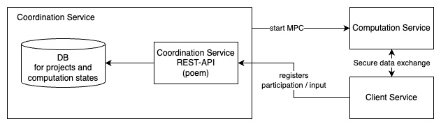
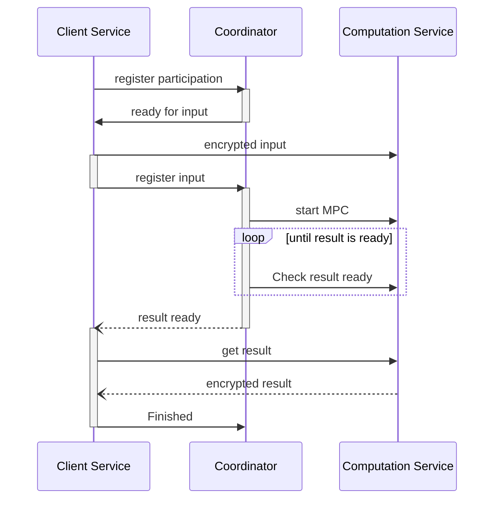
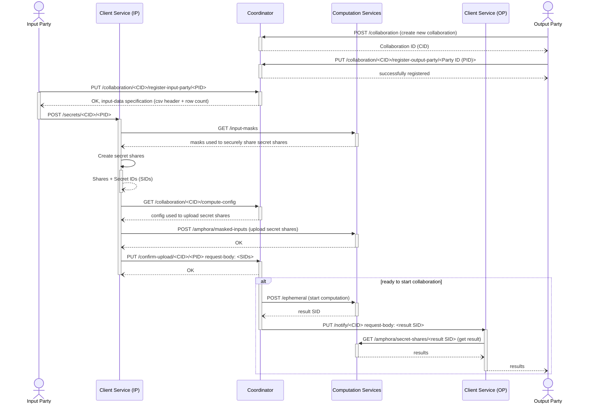

# Coordination Service

## 1-Component Overview
***Description:***
The coordination service coordinates different client services for collaborative scenarios as well as the computation service.

***Objective:***
The idea is to have a central point to facilitate coordination.
Allowing clients to find collaborations, start the MPC execution when sufficient inputs are available, and inform them when results are available.

## 2-Service Dependencies
***External Dependencies:***
This service realizes a REST-API using the [poem](https://github.com/poem-web/poem/tree/master) framework.

***Internal Dependencies:***
The component itself requires a form of database to keep track of collaborations.

## 3-Service Architecture

***Hight-Level Architecture:***

Mainly, the coordination service allows clients to find collaborations, register participation and provided inputs, starts the MPC execution, and informs clients when results are available.

## Interaction between compute, client, coordination service and parties
Next, an overview of communication between the three services and parties is given.
We assume the following:
* Computation Service is running
* Coordination Service has the configuration (config) for the Computation Service (i.e., IP addresses of Carbyne Stack instances)

The Input Party (IP) provides data to a collaboration, the Output Party (OP) receives the computed results of the collaboration.
There can be multiple Input and Output Parties and each runs its own Client Service.

### In text format

In this example the output party acts as the initiator and creates a new collaboration on the coordinator. The collaboration contains the MPC program and input data specification for it. The output party then registers for a collaboration providing the endpoints of its client service to the coordinator.

The input party registers for a collaboration. The coordinator returns the specification for the input data.

Afterword the input party uploads the data for the collaboration to its client service. The client service calculates the secret shares from the data and distributes the shares to the different computation services. To find the computation services the client service requests the compute-service-configuration from the coordinator. Lastly the client service notifies the coordinator that the data was successfully uploaded to the computation services and provides the ids of the crated secrets.

If the collaboration is ready to be executed (e.g. all input parties have uploaded the data) the coordinator starts the calculation of the mpc program. After the computation is finished the coordinator notifies the client service of the output party which is now able to get the results from the computation service.

## 4-REST API
The Rest-API is described by the provided [OpenAPI](openapi.yml) specification.

## 5-Stub
A service stub is defined in [stub](../stub/README.md).
