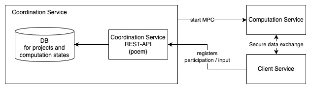
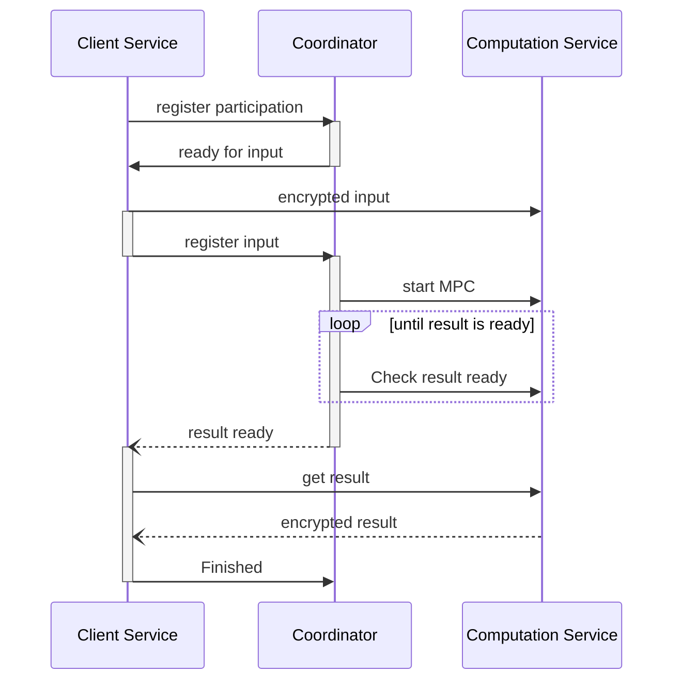

# Coordination Service

## 1-Component Overview
***Description:***
The coordination service coordinates different client services for collaborative scenarios as well as the computation service.

***Objective:***
The idea is to have a central point to facilitate coordination.
Allowing clients to find collaborations, start the MPC execution when sufficient inputs are available, and inform them when results are available.

## 2-Service Dependencies
***External Dependencies:***
This service realizes a REST-API using the [poem](https://github.com/poem-web/poem/tree/master) framework.

***Internal Dependencies:***
The component itself requires a form of database to keep track of collaborations.

## 3-Service Architecture

***Hight-Level Architecture:***

Mainly, the coordination service allows clients to find collaborations, register participation and provided inputs, starts the MPC execution, and informs clients when results are available.

## 4-REST API
The Rest-API is described by the provided [OpenAPI](openapi.yml) specification.