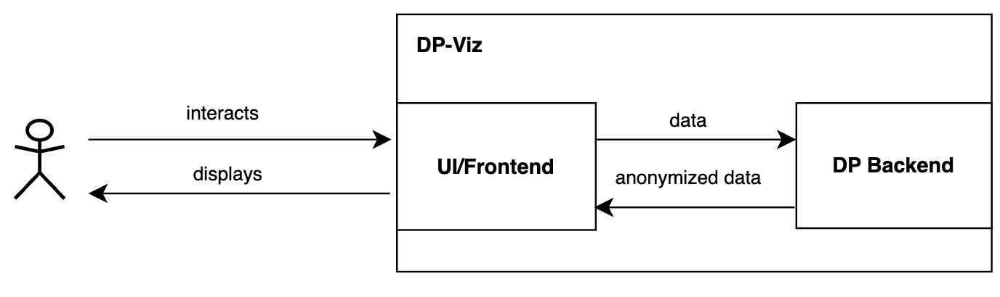
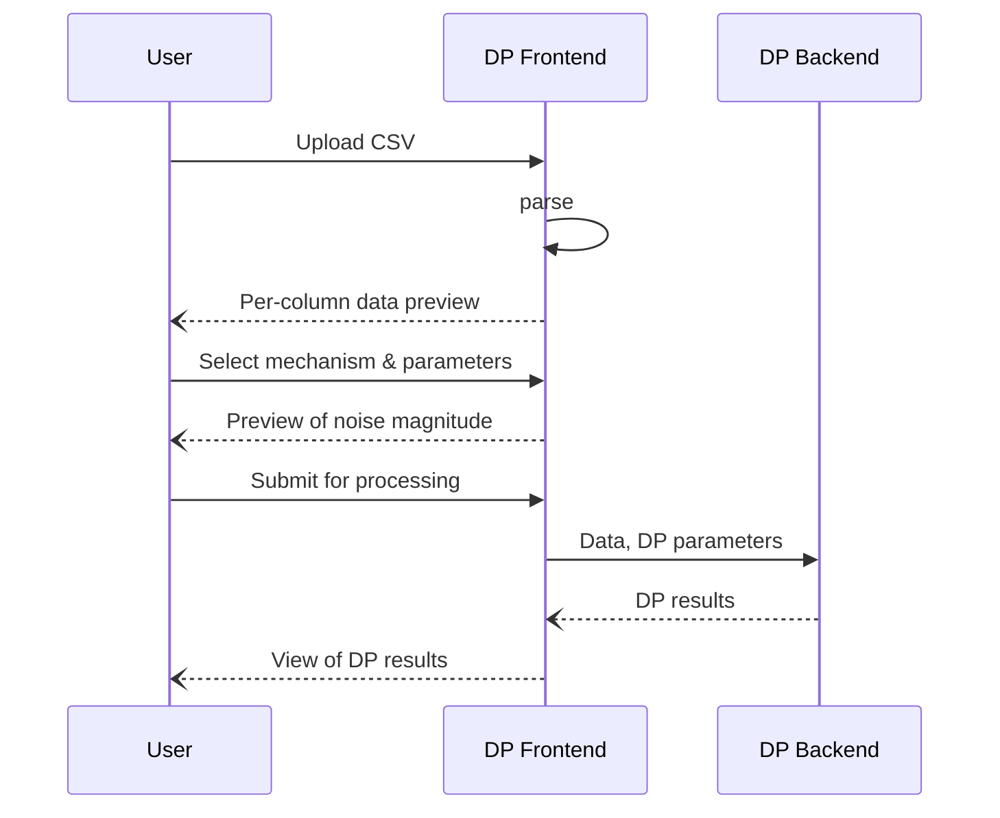

# DP-Viz

## 1-Component Overview:
**Description**:
The component aims to help data analysts with assessing the privacy-utility trade-off inherent to anonymization and provide visual feedback. Specifically, focusing on anonymization satisfying differential privacy (DP).
It is a web frontend reachable via the Browser.

Informally, DP requires function-dependent parameterized randomization - provided by so-called *DP mechanisms* typically in the form of additive noise - that hide the impact that a single record can have on a function evaluation.
For detailed description of differential privacy, we refer to Deliverable D4.1.

**Objectives**:
The objectives are to provide visual intuition, utility-privacy feedback, and initial parameterization guidance for anonymization with differential privacy.

## 2-Service Dependencies:
**External Dependencies:**
- The component relies on the Java version of [Google's DP library](https://github.com/google/differential-privacy) as a backend.
- SAPUI5 (frontend toolkit for web-based graphical interfaces with HTML/CSS/Javascript)
- Plotly.js (visualization/graphs)
- Node.js
- SpringBoot

**Internal Dependencies:**
None.

## 3-Service Architecture:
**High-Level Architecture**:
The architecture ([draw.io file](diagrams/dpviz.drawio)) is shown below:

**Data Flow**:
DP-Viz consists of a web-based frontend (DP Frontend) that interfaces with a Java-based backend (DP Backend):
