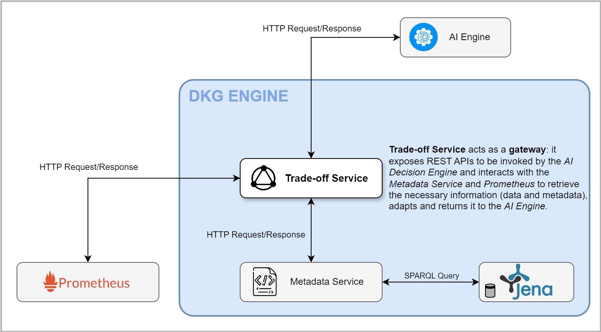

# Trade-Off Service

## Component Overview

The **Trade-Off Service** is the bridge that connects the _AI Decision Engine_
and the _Distributed Knowledge Graph (DKG)_.  
Whenever there is a need to update the resource information in use of a workload
or a node, the AI Decision Engine will interact with the Trade-Off Service and
pass on the information of the new workload in terms of CPU, RAM, network,
disk usage and energy. Once received, the Trade-Off Service will then take care
of normalising this information and transmitting it in persistence to the
Metadata Service in the shape of SPARQL Queries.

### Objectives

Trade-Off Service main goal is to forward the requests received from outside
(supposedly the AI Engine) to the Metadata Service, in order to retrieve and/or
update the information about the cluster nodes and workload.  
For this purpose, it exposes a REST API interface to allow the following operations:

* retrieve and/or update **nodes** _current_ and _maximum usage_
* retrieve and/or update _allocated_ **workloads** and their _demand_

The later interaction with the Metadata Service is based on specifically prepared
custom SPARQL queries.

## Component Dependencies

* **Metadata Service** - being the Trade-Off Service the interface between
the _DKG Engine_ and the external world, it needs the _Metadata Service_ to be
up and running in order to collect the required information to the _AI Engine_
or perform the requested update on the current status of the workloads

## Component Architecture and Interactions

