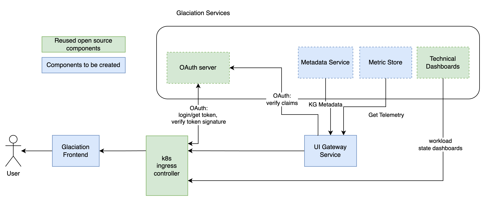

# UX and Dashboards

Created by: Konstantin Tatarnikov
Created time: January 30, 2024 11:40 AM
Doc stage: Draft
Tags: Engineering
Version: 1.0

# Problem statement

Glaciation node is expected to have user interface component. This document outlines UX component design and interactions between the UX and other services.

## 1. Component Overview:

**Description**: 

UX component provides comprehensive information about the Glaciation node workloads, workload telemetry, glaciation node management as well as custom knowledge graph queries.

**Objectives**: 

UX - provides summary information as well as details for the following knowledge graph entities:

- User workload
- User Workload telemetry
- Glaciation node
- Datasets available on the glaciation node
- Energy consumption metrics
- Usage Predictions

UX allows searching the knowledge graphs and return summary and its details in an entity centric way.

Users can create customized panels based on own SPARQL queries.

## 2. Service Dependencies:

### **Dependencies:**

**Authentication and Authorization** - component provides user management - user registration and permission management, single signon services and authorization validation for the users.

For the moment we are assuming (per @Konstantin Tatarnikov) this is OAuth server that can provide jks token and validate its signature.

**Metadata Service** - is knowledge graph API for glaciation node. The service keeps knowledge graphs in internal repository and provides necessary interfaces tailored for various internal components - one of those components is UX Gateway service.

**Metric Store** - Timeseries database that keeps actual and predicted telemetry information. We want to use influxdb for that.

### Components:

**UX Gateway Service** - is an intermediary component between Glaciation Frontend and Metadata Service. The service adapts user interface queries into a series of SPARQL requests to MetadataService and telemetry requests from Storage Service. The service also checking user permissions via oauth server and filters the KGs that a user is not allowed to access.

**Glaciation Frontend** - browser client application that presents the metadata and telemetry in a handy way.

**K8s ingress controller** - the glaciation node ingress controller. UI traffic entry point, authentication proxy and service router. We are assuming the ingress controller is [nginx ingress controller](https://kubernetes.github.io/ingress-nginx/) or [envoy gateway](https://www.envoyproxy.io/). When user is accessing GNode resources, ingress controller redirects user to oauth server and handle [auth flow](https://kubernetes.github.io/ingress-nginx/examples/auth/oauth-external-auth/).

## 3-Service Architecture:

**High-Level Architecture**



Provide a high-level overview of the service architecture, including components and their interactions.

### **User personas**

**Glaciation Operator** - e.g. Dev ops engineer who is interested in the health of the glaciation node, workloads, and hardware. The responsibilities of the node operator is to make sure that the glaciation node is functioning according to the requirements. Operator should receive alerts when the hardware is broken or software components are faulty or not making progress.

**Workload Engineer** - (e.g. Data Scientist, ML engineer, Data Engineer) the person who want to run the workload in the Glaciation Network. For the engineering work the person can browse dataset metadata with the help of Glaciation Frontend and correspondingly adjust the workload code. After running the workload on the glaciation network he/she can monitor the workload by browsing the technical dashboards.

### **Data Flow, Use cases and Interactions**

**1 Authentication and Authorization**

We are assuming that the users are registered in the system using Authentication and Authorization component. We expect oauth server is available from that component. 

Once user access the glaciation frontend he/she redirected to auth login screen where auth information is entered. After successful authentication user gets JKS token which is sent in all subsequent calls to UX Gateway Service which verifies the JKS signature and user permissions for resources.

**2 UX Entities centric panels**

The user can access the entity centric panels. The entity in this context represents the entity centric knowledge graph(s). The entities are at least the following:

- Workload - the panel displays metadata information about the workload. The language of the workload, resource scheduling constraints, dataset dependencies. The workload can also contain the reference to the Workload Telemetry KG
- Workload Telemetry - the KG contains the workload telemetry metadata. It includes the types of telemetry (metrics, logs), data set link, dashboards link.
- DataSet - the KG contains the dataset metadata - the format, data source information, etc
- Glaciation Node - The KG contains the information about the glaciation node. This includes

The entity centric panels can offer the following functions:

- show a list of KG entity summary
- show an KG entity details
- text search for entities

The UX Gateway Service has the following API:

- **ListKnowledgeGraphEntities** - lists summary information of knowledge graph

GET /kgs/?entity=<entity type>

```bash
[
  {
  },
	...
]
```

- **GetKnowledgeGraph** - returns KG tuples

GET /kg/<id>?format=tuples

```bash
[
	{
		"src": "<id>",
	  "rel": "<id>",
	  "dst": "<id>"
	},
	...
]
```

- **SearchKnowledgeGraph** - text search of knowledge graphs

GET /kgs/search?q=<text query>&format=tuples&entity=<KG entity>

```bash
[
	{
		"id": "<SG id>",
    "summary": "",
		"matches": [ // list of tuples with text matches
			{ 				
        "text": "<text with highlighted matches>" 
				.. // may be something else 
			}
		]
	}
]
```

The API above are transformed to SPARQL queries and executed against metadata service

**3 Workload technical information**

The workload knowledge graph contains a link to a technical dashboard which provides technical workload information - raw metrics and logs. The workload engineer can get access to the telemetry information via workload centric UX panel.

The technical information is available via grafana dashboard via corresponding route of k8s ingress.

**4 UX using custom user SPARQL queries**

The system user can create custom query using SPARQL language. The UX application presents the result of this query in the unified way.

To be refined when more information is available, e.g. user queries are defined: The API of UX Gateway service for the custom SPARQL queries.